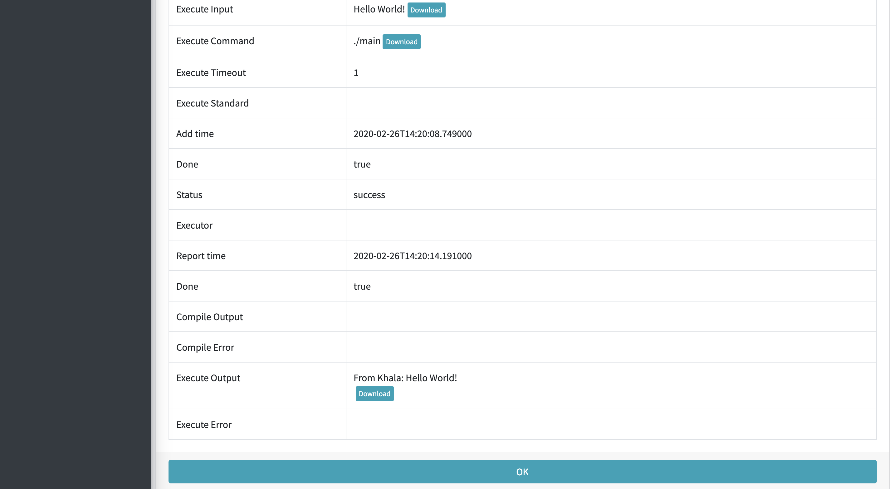

# KV2 - Khala

Khala is a distributed platform prototype for general computing task execution.

This platform aims to provide a easy-deploy and easy-use system which organize and make full use of
a cluster of computers where general computing tasks on command line (e.g. program compiling, model simulation, numeric
computing) can be executed parallel.

The system has the following features:

- High availability: The system is robust and can tolerate failures of up to half of the nodes.
- Scalability: The system can be scaled up and down easily to reach a balance between performance and resources.
- Extensibility: The system provides HTTP API and is easy to extent.

The system consists of three types of nodes, including Judicator (monitors the cluster, provides RPC interfaces and
maintain data), Executor (reports to Judicators and executes computing tasks) and Gateway (provides HTTP API and a 
user-friendly website).

The system is developed using Python language, and uses Etcd for clustering and service discovering, MongoDB with
replica set for data storage, Uwsgi for web server and Apache Thrift for RPC interfaces. The system is also designed to
work majorly in docker containerized environment.

## Getting Started

#### Deployment

The easiest way of getting and deploying the system is to use pre-built docker image from 
[docker hub](https://hub.docker.com/repository/docker/comradestukov/khala).

```bash
KHALA='comradestukov/khala:v0.1'
docker pull $KHALA
```

Then, deploy the first Judicator.

```bash
KHALA='comradestukov/khala:v0.1'
IP=`ifconfig | grep -Eo 'inet (addr:)?([0-9]*\.){3}[0-9]*' | grep -Eo '([0-9]*\.){3}[0-9]*' | grep -v '127.0.0.1'`
docker container run -v /var/run/docker.sock:/var/run/docker.sock \
-p 2000:2000 -p 2001:2001 -p 3000:3000 -p 4000:4000 $KHALA judicator \
--docker-sock=unix:///var/run/docker.sock \
--boot-print-log \
--etcd-print-log \
--mongodb-print-log \
--main-print-log \
--etcd-cluster-init-independent \
--etcd-advertise-address=$IP \
--mongodb-advertise-address=$IP \
--main-advertise-address=$IP \
--etcd-advertise-peer-port=DOCKER \
--etcd-advertise-client-port=DOCKER \
--mongodb-advertise-port=DOCKER \
--main-advertise-port=DOCKER
```

After the Judicator is stable, deploy a Gateway.

```bash
KHALA='comradestukov/khala:v0.1'
IP=`ifconfig | grep -Eo 'inet (addr:)?([0-9]*\.){3}[0-9]*' | grep -Eo '([0-9]*\.){3}[0-9]*' | grep -v '127.0.0.1'`
docker container run -v /var/run/docker.sock:/var/run/docker.sock \
-p 7000:7000 $KHALA gateway \
--docker-sock=unix:///var/run/docker.sock \
--boot-print-log \
--etcd-print-log \
--uwsgi-print-log \
--etcd-cluster-join-member-client=http://$IP:2001
```

You have to have at least one Executor to execute tasks.

```bash
KHALA='comradestukov/khala:v0.1'
IP=`ifconfig | grep -Eo 'inet (addr:)?([0-9]*\.){3}[0-9]*' | grep -Eo '([0-9]*\.){3}[0-9]*' | grep -v '127.0.0.1'`
docker container run -v /var/run/docker.sock:/var/run/docker.sock $KHALA executor \
--docker-sock=unix:///var/run/docker.sock \
--boot-print-log \
--etcd-print-log \
--main-print-log \
--etcd-cluster-join-member-client=http://$IP:2001
```

You can have more Executors and Gateways using the commands above. If you wish to have more Judicators, use
the following commands.

```bash
KHALA='comradestukov/khala:v0.1'
IP=`ifconfig | grep -Eo 'inet (addr:)?([0-9]*\.){3}[0-9]*' | grep -Eo '([0-9]*\.){3}[0-9]*' | grep -v '127.0.0.1'`
docker container run -v /var/run/docker.sock:/var/run/docker.sock \
--expose 2000 \
--expose 2001 \
--expose 3000 \
--expose 4000 -P $KHALA judicator \
--docker-sock=unix:///var/run/docker.sock \
--boot-print-log \
--etcd-print-log \
--mongodb-print-log \
--main-print-log \
--etcd-cluster-join-member-client=http://$IP:2001 \
--etcd-advertise-address=$IP \
--mongodb-advertise-address=$IP \
--main-advertise-address=$IP  \
--etcd-advertise-peer-port=DOCKER \
--etcd-advertise-client-port=DOCKER \
--mongodb-advertise-port=DOCKER \
--main-advertise-port=DOCKER
```

#### Usage

Now we can execute our first task.

Visit http://localhost:7000/ and get into the system. You will be redirected to the search page which should look
like the following (though there should be no tasks).


Choose STATUS - Executors to confirm there is at least one Executor running. Then, choose TASK - Add tab in the right
slide bar of the website.

Fill in the form with the following parameters (keep void if not specified).

- **User Id:** 0
- **Compile Source File Name:** main.cpp
- **Compile Source Text:**

```cpp
#include <iostream>
using namespace std;
char str[100];
int main()
{
    cin.getline(str, 100);
    cout << "From Khala: " << str << endl;
    return 0;
}
```

- **Compile Command:** g++ -g -Wall -o main main.cpp
- **Compile Timeout:** 10
- **Execute Input:** Hello World!
- **Execute Command:** ./main
- **Execute Timeout:** 1

Click Add button at the bottom of the pages, and wait for a few seconds on the task view page. The task should be
assigned and executed. Upon finishing execution, you should see results like the following.



## Next Steps

Please view [documents index](document/README.md) to make learn more about the system.

## Acknowledgement

- **License:** This program is published under [MIT License](LICENSE.txt).
- **Author:** SBofGaySchoolBuPaAnything *(Used Name: Eshttc_Cty, ComradeStukov)*
- **Contact:** Any bugs, issues, questions or suggestions please send to author's private email: 1532422769@qq.com,
or official college email: tc2819@ic.ac.uk, 15031211@buaa.edu.cn;
