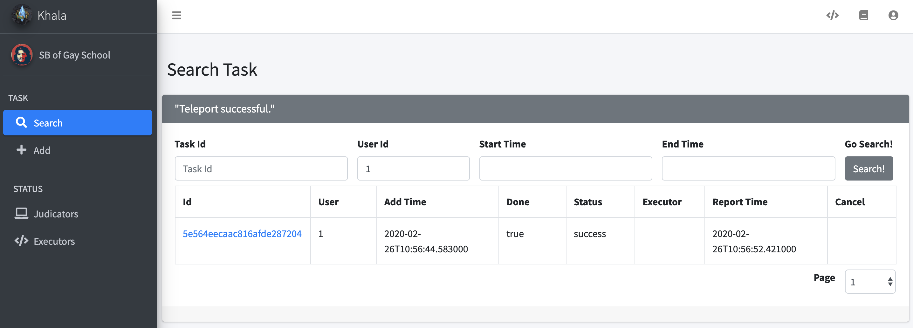

# Usage

This page introduces how to use the system to execute tasks through website.

*Same operations can be carried out through HTTP APIs. See [http_api.md](http_api.md) for details.*

## Principles and Directory structure

A task is described as a sequence of shell (bash) commands. It is divided into two parts: compile command and
execute command.

Upon running, compile command will be executed first, and then, if succeeded, execute command will be executed with
input stream redirected from provided execute input. Both compilation and execution output and error stream will be
recorded and later returned.

When task is executing, the working directory of the task looks like the following.

```
work directory
      |
      |---- data
      |      |
      |      |---- [files unzipped from execute data]
      |
      |---- compile.sh (compile command)
      |
      |---- execute.in (execute input)
      |
      |---- execute.sh (execute command)
      |
      |---- [files unzipped from compile source]

```

## Website view

The website looks like the following.



## Add Task

Choose TASK - Add tab in the right slide bar of the website.

You have to fill in a form to describe the task.

- **User Id:** An int indicating the submitting user. It will only be used as a reference for later searching.
- **Compile Source:** The compile source zip file.
- **Compile Source File Name** and **Compile Source Text:** You can create a compile source zip file contains only one file
with name specified by Compile Source File Name and content by Compile Source Text. These should be both filled or
empty, and will be overwritten if Compile Source has been uploaded.
- **Compile Command:** Bash command for compilation.
- **Compile Timeout:** Timeout for compilation. 0 indicating unlimited compilation timeout.
- **Execute Input:** Input stream of execution.
- **Execute Data:** The execute data zip file.
- **Execute Data File Name** and **Execute Data Text:** You can create an execute data zip file contains only one file with
name specified by Execute Data File Name and content by Execute Data Text. These should be both filled or empty, and
will be overwritten if Execute Data has been uploaded.
- **Execute Command:** Bash command for execution.
- **Execute Timeout:** Timeout for execution. 0 indicating unlimited execution timeout.
- **Execution Standard:** Standard output of execution. It will only be used as a reference for checking execution result.

## Search Task, View Task and Cancel Task

Choose TASK - Search tab in the right slide bar of the website.

You can search tasks with conditions:

- **Task Id**
- **User Id**
- **Start time (earliest time of task submission)**
- **End time (latest time of task submission)**

You can click the Id of each task to view the task in details. When viewing tasks, compile source and data execute can 
only be downloaded, if exist. All fields which exceeded 1000 chars will be truncated, and you can download the file to
view full text.

Task search and task view page will refresh regularly. The refreshed result of task search page might be different if 
the search condition has changed.

Undone task can be cancelled both on task search page and task view page, through the Cancel button.

## Executors and Judicators

Choose STATUS - Judicators to see all working Judicators.

Choose STATUS - Executors to see all working Executors.

These two pages will refresh regularly.
